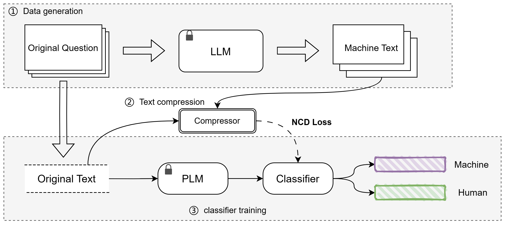

The overall framework of C-Net is shown in the figure

The portion of npz_gzip in this code is referenced in[ACL2023](https://aclanthology.org/2023.findings-acl.426/)

# Data preprocessing
Our raw data comes from [HC3](https://arxiv.org/pdf/2301.07597.pdf), which can be obtained from [https: //github.com/Hello-SimpleAI/chatgpt-comparison-detection.]()

To obtain the machine generated text for the corresponding problem, first run data_process to obtain the machineutext field

`python data_process.py --data_path chatgpt/unfilter_full/en_train.csv --save_path chatgpt/unfilter_full/train.csv --api_key your_openai_key`

The processed training data should include at least three fields: label, answer, and machine_text

# Train
`python train.py`

# Test
Use the trained model from the above process for testing
`python Test.py`